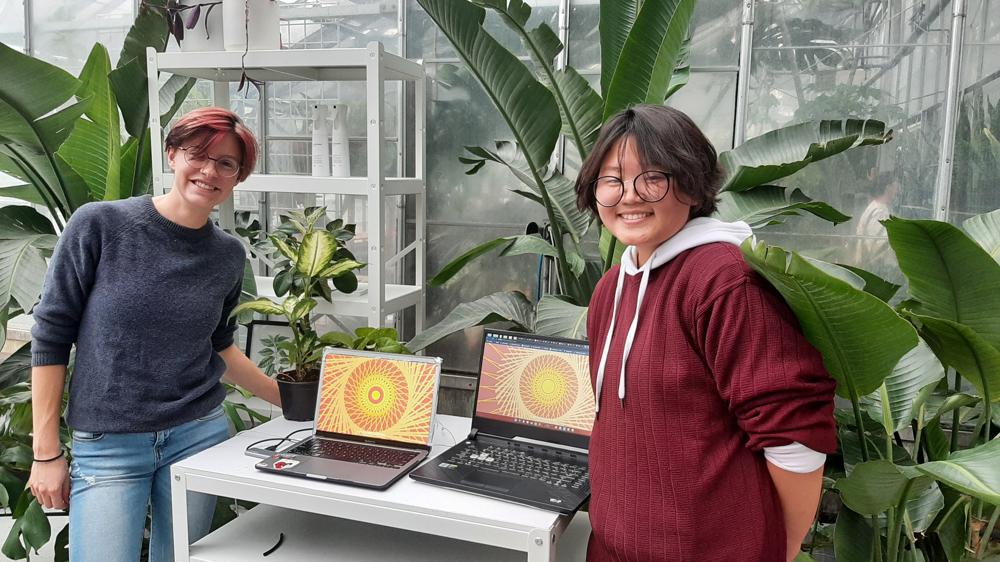

# Plants and Screens
Authors / Auteurs: [Noémie](https://github.com/FancyNoemie) & [Katt](https://github.com/lKattt)

>This project was created for CART253, Creative Computing 1 at Concordia University. Students were asked to integrate a digital art piece to a chosen environnement.

>Ce projet a été créé dans le cadre du cours CART253 - Créativité Numérique à l'université Concordia. Les étudiants devaient intégrer une oeuvre digitale dans un environnement choisi.
---

In this project, the participant is invited to stop, and take the time to appreciate nature as an important living element of our environment. 
At the centre of the installation, a display shows a circle pattern that grows and moves, reacting to the sound in the surrounding space. A closer look will show you red wires, one for each of the 6 different plants around the device, that connects them to the computer. A physical contact with the plants will make them talk, allowing an interaction between the plant and the participant.

The dialogue and visual reaction is only possible if the plant is healthy and has been watered recently. It's trough water that the physicals electric current flows between human and plant, using the machine as an intermediary.

---

This project was design to work with a [Makey Makey]https://makeymakey.com/ board. All the interactions can be made with the key that can be programmed with a makey makey.
